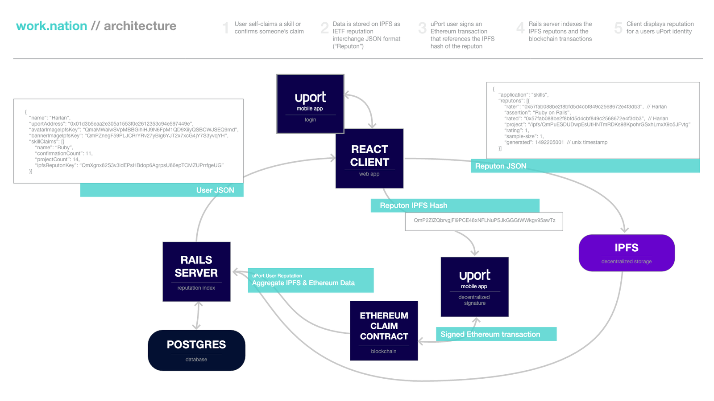

# Work.nation

This is a proof of concept demo which allows the creation of contribution claims and confirmations as signed claims, using [uPort](https://www.uport.me) + [IPFS](https://ipfs.io) + [Ethereum](https://ethereum.org).

## Live demo

https://demo.worknation.io

## Architecture

A visual overview of the components and dataflows between them:

[](https://cdn.rawgit.com/worknation/work.nation/e6be095be0c1c92efadb2617238c2ac8351b6011/images/architecture.png)

## Login

Users log in with [uPort](https://www.uport.me), which means that they log in with true decentralized authentication: an identity that is entirely owned and controlled by them, on their devices, with no username or password ever stored in the Work.nation system.

[](https://cdn.rawgit.com/worknation/work.nation/e6be095be0c1c92efadb2617238c2ac8351b6011/images/login.png)

## Projects

Users create projects by entering project attributes, expected contribuitons and confirming with uPort. They can then search for contributors based on past contributions to invite to the project.

[](https://cdn.rawgit.com/worknation/work.nation/e6be095be0c1c92efadb2617238c2ac8351b6011/images/projects.png)

Technically, the creation of a project is broken into two steps:

1. Create a project "permanode" (inspired by [Camlistore's permanodes](https://camlistore.org/doc/schema/permanode)) -- an immutable anchor containing data that will never change:
      - the creator's uPort ID
      - a timestamp
      - a random string to ensure a unique ID (hash)
1. Create a project profile which references that permanode ID -- this is where all mutable data is stored; and a new profile will be created when any update is required

### Project Permanodes

Creating a project permanode has the following steps:

1. Create permanode JSON as described above
1. The JSON is canonicalized (sorted by keys)
1. The canonical JSON is stored in IPFS
1. The resulting IPFS ID (hash) is added to an Ethereum contract _by the Ethereum address of the uPort user_

Example permanode:

```js
{
  creator: "0xfdab345e368120a5ba99549c1f74371cd73cdb93",
  random: "LHfpaCvFMgyxTKCawtmn1qdbc91UhM6n1cL2aQRki9a",
  timestamp: "2017-05-05T20:54:55.337Z",
  type: "permanode"
}
```

This permanode has the ID [`/ipfs/QmUbGAEJk7HZXTSWV7dFyrbNecRuhGnbPvYCbgB6UtBHBr`](https://ipfs.io/ipfs/QmUbGAEJk7HZXTSWV7dFyrbNecRuhGnbPvYCbgB6UtBHBr).

### Project Profiles

We can then create a profile which references the above project permanode.  The process is largely identical to the permanode creation steps in IPFS and Ethereum.

Example project profile:

```js
{
  address: "https://chicken-robot.example.com",
  contact: "0x57fab088be2f8bfd5d4cbf849c2568672e4f3db3",                // uport id of project contact
  imageUrl: "https://s-media-cache-ak0.pinimg.com/736x/2b/22/f8/2b22f82e7843d732c5def05055529c55.jpg",
  name: "Chicken Robot",
  permanodeId: "/ipfs/QmUbGAEJk7HZXTSWV7dFyrbNecRuhGnbPvYCbgB6UtBHBr",  // project permanode
  skills: "Chicken Wrangling, Robot Design",
  timestamp: "2017-05-05T20:54:55.918Z",
  type: "project"
}
```

<!-- This project profile has the ID [`/ipfs/QmXSgeC1zc95a1bTLkdBCjDXSah8S4MWVB59hupAvXbVtp`](https://ipfs.io/ipfs/QmXSgeC1zc95a1bTLkdBCjDXSah8S4MWVB59hupAvXbVtp). -->

## Contribution Claims and Confirmations

Users can self-claim contributions provided to a given project, and confirm contribution claims made by other users.

[](https://cdn.rawgit.com/worknation/work.nation/e6be095be0c1c92efadb2617238c2ac8351b6011/images/claims.png)

### Contribution Claim

Technically, the process of creating each claim is identical in the IPFS and Ethereum steps described in project creation above. The differences are only in the content of the JSON:

1. Each contribution claim is represented in [IETF Reputon](https://tools.ietf.org/html/rfc7071) format
1. `rater` and `rated` are both set to the contribution claimant
1. The extra field `project` is added, containing the project permanode ID

For example, Alice claims that she has contributed Ruby on Rails code on the project _Chicken Robot_ created above:

```js
{
    "application": "skills",
    "reputons": [{
        "rater": "0x57fab088be2f8bfd5d4cbf849c2568672e4f3db3",  // Alice
        "rated": "0x57fab088be2f8bfd5d4cbf849c2568672e4f3db3",  // Alice
        "assertion": "Ruby on Rails",
        "project": "/ipfs/QmUbGAEJk7HZXTSWV7dFyrbNecRuhGnbPvYCbgB6UtBHBr"
        "rating": 1,
        "sample-size": 1,
        "generated": 1492205001                                 // unix timestamp
    }]
}
```

This claim has the IPFS address `QmX3eFcpPL3bN3EBzcPnUH4fTiJyWi3G8NxEZjfKCGqrnd`.

### Example Contribution Confirmation

The IPFS and Ethereum steps are identical to those described above. The differences are in the content:

1. Like contribution claims, each confirmation claim is represented in [IETF Reputon](https://tools.ietf.org/html/rfc7071) format
1. `rater` is the uPort address of the confirmer
1. `rated` is the IPFS ID of the original contribution claim

For example, Bob confirms that Alice has provided Ruby on Rails contributions on project _Chicken Robot_:

```js
{
    "application": "skills",
    "reputons": [{
        "rater": "0x9df6d7f675d119228eae858213587c0687d0a498",     // Bob
        "assertion": "confirm",
        "rated": "QmX3eFcpPL3bN3EBzcPnUH4fTiJyWi3G8NxEZjfKCGqrnd", // Alice's signed claim of ROR skills
        "rating": 1,                                               // 1 = master, 0.5 = confirm
        "normal-rating": 0.5,
        "sample-size": 1,
        "generated": 1492205002
    }]
}
```

## Code Bases

Work.nation is fully open source under an Apache 2 license.  The code is available in these locations:

- Ruby on Rails (API only) [server](https://github.com/worknation/server.work.nation)
- React [client](https://github.com/worknation/client.work.nation)
- "Claim" [solidity contract](https://github.com/worknation/work.nation/blob/master/Claim.sol) for registering the IPFS addresses of claims in Ethereum

## Reputation Index Schema

The Rails server acts as a "reputation index".  Below is a snapshot of the database schema.

[](https://cdn.rawgit.com/worknation/work.nation/e6be095be0c1c92efadb2617238c2ac8351b6011/images/diagram.work.nation.png)

## Contributing

Contributions and pull requests are most welcome.  If you have a big idea, we encourage you to open an issue in one of the repos above to discuss it.  Small ideas or fixes just go for it!
