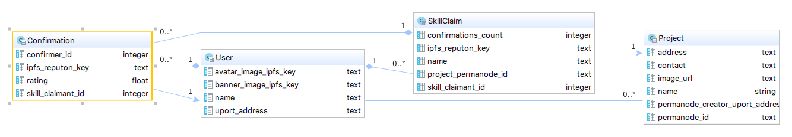

# Work.nation

[](https://raw.githubusercontent.com/worknation/work.nation/18f74a6c96247fc8c18a12a2849daca4642191aa/images/architecture.png)
[Full Size](https://raw.githubusercontent.com/worknation/work.nation/18f74a6c96247fc8c18a12a2849daca4642191aa/images/architecture.png)

## Ethereum "Claim" Contract

## Reputon format

```js
// Self claim: Harlan claim Ruby on Rails skill
// this claim has IPFS address QmX3eFcpPL3bN3EBzcPnUH4fTiJyWi3G8NxEZjfKCGqrnj
{
    "application": "skills",
    "reputons": [{
        "rater": "0x57fab088be2f8bfd5d4cbf849c2568672e4f3db3",  // Harlan
        "assertion": "Ruby on Rails",
        "rated": "0x57fab088be2f8bfd5d4cbf849c2568672e4f3db3",  // Harlan
        "rating": 1,
        "sample-size": 1,
        "generated": 1492205001  // unix timestamp
    }]
}

// Confirmation: Alice confirms Harlan's Ruby on Rails skill
{
    "application": "skills",
    "reputons": [{
        "rater": "0x9df6d7f675d119228eae858213587c0687d0a498", // Alice
        "assertion": "confirm",
        "rated": "QmX3eFcpPL3bN3EBzcPnUH4fTiJyWi3G8NxEZjfKCGqrnj", // Harlan"s signed claim of ROR skills
        "rating": 1, // 1 = master, 0.5 = confirm
        "normal-rating": 0.5,
        "sample-size": 1
        "generated": 1492205002
    }]
}
```

## Project Permanode

```js
// https://ipfs.io/ipfs/QmUbGAEJk7HZXTSWV7dFyrbNecRuhGnbPvYCbgB6UtBHBr

{
  creator: "0xfdab345e368120a5ba99549c1f74371cd73cdb93",
  random: "LHfpaCvFMgyxTKCawtmn1qdbc91UhM6n1cL2aQRki9a",
  timestamp: "2017-05-05T20:54:55.337Z",
  type: "permanode"
}
```

## Project Profile

```js
// https://ipfs.io/ipfs/QmXSgeC1zc95a1bTLkdBCjDXSah8S4MWVB59hupAvXbVtp

{
  address: "https://chicken-robot.example.com",
  contact: "0x57fab088be2f8bfd5d4cbf849c2568672e4f3db3", // uport id
  imageUrl: "https://s-media-cache-ak0.pinimg.com/736x/2b/22/f8/2b22f82e7843d732c5def05055529c55.jpg",
  name: "Chicken Robot",
  permanodeId: "/ipfs/QmUbGAEJk7HZXTSWV7dFyrbNecRuhGnbPvYCbgB6UtBHBr",
  skills: "Chicken Wrangling, Robot Design",
  timestamp: "2017-05-05T20:54:55.918Z",
  type: "project"
}

```

## Schema

[](https://raw.githubusercontent.com/worknation/work.nation/18f74a6c96247fc8c18a12a2849daca4642191aa/images/diagram.work.nation.png)
[Full Size](https://raw.githubusercontent.com/worknation/work.nation/18f74a6c96247fc8c18a12a2849daca4642191aa/images/diagram.work.nation.png)

